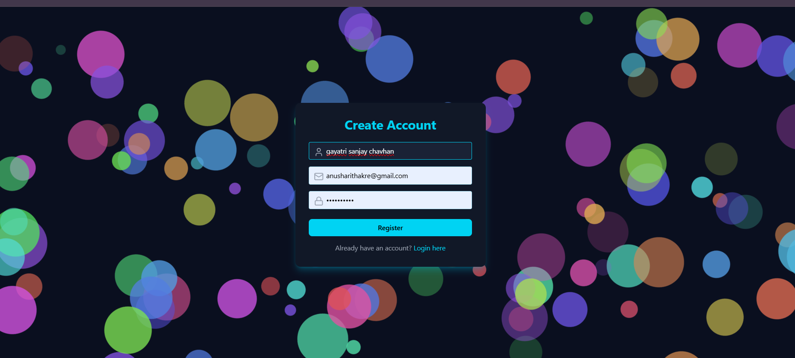
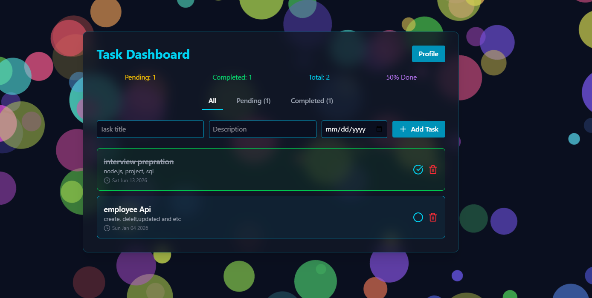
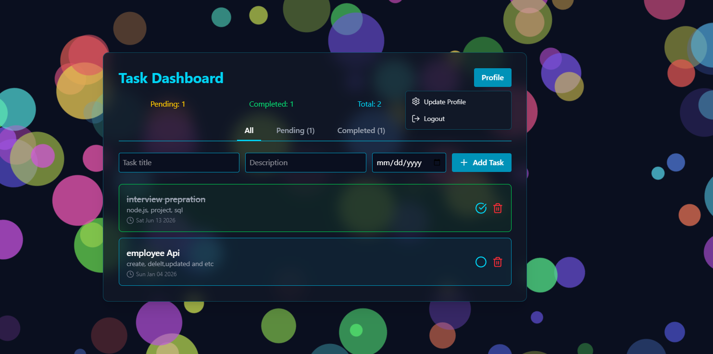

# 🚀 Smart Todo

A modern task management web application built with React.js that helps users organize, track, and manage their daily tasks efficiently. The application provides a clean dashboard interface with task statistics, progress tracking, due dates, and task management features.

---

## ✨ Features

* Create new tasks
* Edit existing tasks
* Delete tasks
* Mark tasks as completed
* Track pending and completed tasks
* View task statistics
* Monitor productivity through dashboard metrics
* Due date management
* Responsive and user-friendly interface
* Real-time task status updates

---

## 📊 Dashboard Overview

The dashboard provides quick insights into:

* Total Tasks
* Pending Tasks
* Completed Tasks
* Completion Percentage
* Task Progress Summary

This helps users easily monitor their productivity and manage work efficiently.

---

## 🛠️ Tech Stack

### Frontend

* React.js
* JavaScript (ES6+)
* HTML5
* CSS3

### Backend

* Node.js
* Express.js

### Database

* MySQL

### Tools

* Git
* GitHub
* VS Code

---

## 📂 Project Structure

```text
smart-todo/
│
├── frontend/
│   ├── src/
│   ├── public/
│   └── package.json
│
├── backend/
│   ├── routes/
│   ├── controllers/
│   ├── models/
│   ├── server.js
│   └── package.json
│
├── screenshots/
│   └── dashboard.png
│
└── README.md
```

## 📸 Project Preview


<p align="center">
  
</p>

<p align="center">
  
</p>

<p align="center">
  
</p>

<p align="center">
  
</p>
---

## ⚙️ Installation

### Clone the Repository

```bash
git clone https://github.com/gayu600/smart-todo.git
```

### Navigate to Project Folder

```bash
cd smart-todo
```

### Install Frontend Dependencies

```bash
cd frontend
npm install
```

### Install Backend Dependencies

```bash
cd ../backend
npm install
```

---

## ▶️ Run the Application

### Start Backend

```bash
npm run dev
```

### Start Frontend

```bash
cd ../frontend
npm run dev
```

Frontend:

```text
http://localhost:5173
```

Backend:

```text
http://localhost:5000
```

---

## 🎯 Key Learnings

This project helped strengthen practical knowledge of:

* React Components
* React Hooks
* State Management
* CRUD Operations
* REST APIs
* Express.js
* MySQL Database Integration
* Responsive UI Design
* Git & GitHub Version Control

---

## 🔮 Future Enhancements

* User Authentication
* Task Categories
* Task Priorities
* Notifications & Reminders
* Dark Mode
* Search & Filtering
* Cloud Deployment

---

## 👩‍💻 Author

**Gayatri Chavhan**

Aspiring Full Stack Developer passionate about building scalable and user-friendly web applications.

GitHub: https://github.com/gayu600

---

## ⭐ Support

If you found this project useful, please consider giving it a ⭐ on GitHub.
